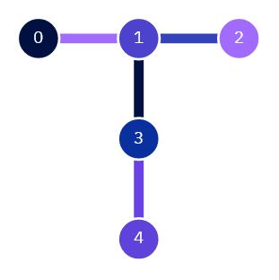

# Education-Hackathon-Template
A simple template which can be used as a starting point for the educational hackathon.

This file can be directly used to write your lecture plan if you want.

## Example Lecture plan

This is a simple example of a lecture plan for a simple topic. Yours does not at all have to follow this structure, since for different topics other structures can make a lot more sense (like teaching theory yourself, not needing to discuss solutions since solutions are clear when they are correct etc.)
It would also make sense to add more than just one visualization, this here is really more of an example on how you can use different elements and link them. 

### Introduction

Duration: 5 Minutes

Form of Teaching: Presentation by Teacher

Giving a small introduction to the topic including a motivation on why one want to learn about this topic.
Showing the following coupling map to help visualize the topic:

 

### Overview

Duration: 5 Minutes

Form of Teaching: Self Reading

Let the students read the additional text which can be found [Here](AdditionalText.md)

### Discussion

Duration: 10 Minutes

Form of Teaching: Open Discussion

Discuss with the students the text the read, and the concepts they saw there.
Let the students ask questions, which other students might answer, and answer yourself if the students cant.
Make sure the basic concepts are understood such that they can solve the exercises.

### Learning Exercises

Duration: 10 Minutes

Form of Teaching: Students solve exercises on their own.

The exercises can be found [Here](ExampleExercise.ipynb)
I will give the students enough time to solve them, and 
will answer questions if they have.

### Discussion of Solutions

Duration: 5 Minutes

Form of Teaching: Open Discussion

Let students present their solutions for the different exercises.
You should also make a file including the solutions and link it in here.

### Advanced Concepts

Duration: 10 Minutes

Form of Teaching: Presentation by Teacher

Explain them some more advanced concepts building up on what they saw in the exercise.

You could write what you want to tell them here. (In case you want to use this for your theory part)

### Testing Exercise

At the end you should also link to at least one testing exercise, which help the students test if they understood the material. 
The solution for this exercise can be in the same file as the other solution if you want.

This will be not part of the exercise, but is thought for the students to test their knowledge.

